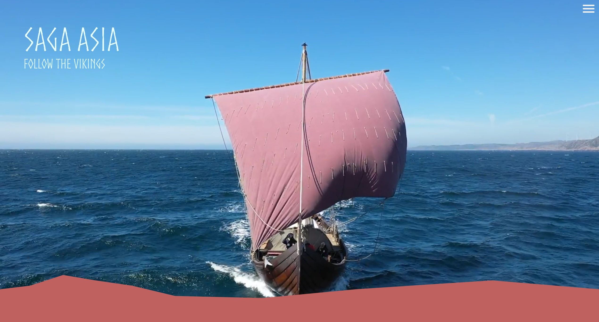

# Saga Farmann - Follow the vikings

Saga Farmann is a web application for a viking boat expedition.



This is a [Next.js](https://nextjs.org/) project bootstrapped with [`create-next-app`](https://github.com/vercel/next.js/tree/canary/packages/create-next-app).

### Table of contents

- [Getting started](#getting-started)
- [Overview](#overview)
  - [Tech utilization](#tech-utilization)
  - [Site features](#site-features)
- [Our process](#our-process)
  - [Built with](#built-with)
  - [Github flow](#github-flow)
  - [CMS](#cms)
- [Variables](#Variables)
  - [Base url](#base-url)
  - [Color scheme](#color-scheme)
  - [Endpoints](#endpoints)
- [Maintenance](#maintenance)
  - [Backend maintenance](#backend-maintenance)
  - [Frontend maintenance](#frontend-maintenance)
- [Further development](#my-process)
- [Code style](#code-style)
- [Fetching data](#fetching-data)
  - [Static Generation](#static-generation)
  - [Incremental Static Regeneration](#incremental-static-regeneration)
- [Technical debt](#technical-debt)

## Getting Started

First, run the development server:

```bash
npm run dev
# or
yarn dev
# or
pnpm dev
```

Open [http://localhost:3000](http://localhost:3000) with your browser to see the result.

You can start editing the page by modifying `pages/index.tsx`. The page auto-updates as you edit the file.

[API routes](https://nextjs.org/docs/api-routes/introduction) can be accessed on [http://localhost:3000/api/hello](http://localhost:3000/api/hello). This endpoint can be edited in `pages/api/hello.ts`.

The `pages/api` directory is mapped to `/api/*`. Files in this directory are treated as [API routes](https://nextjs.org/docs/api-routes/introduction) instead of React pages.

## Learn More

To learn more about Next.js, take a look at the following resources:

- [Next.js Documentation](https://nextjs.org/docs) - learn about Next.js features and API.
- [Learn Next.js](https://nextjs.org/learn) - an interactive Next.js tutorial.

You can check out [the Next.js GitHub repository](https://github.com/vercel/next.js/) - your feedback and contributions are welcome!

## Deploy on Vercel

The easiest way to deploy your Next.js app is to use the [Vercel Platform](https://vercel.com/new?utm_medium=default-template&filter=next.js&utm_source=create-next-app&utm_campaign=create-next-app-readme) from the creators of Next.js.

Check out our [Next.js deployment documentation](https://nextjs.org/docs/deployment) for more details.

## Overview

### Tech utilization

Since most of the pages will serve static content we opted to use NextJS static site generation which means that NextJS
prebuilds and fetches all the data in build time and generates static HTML pages. This approach has many advantages the main one being
speed, while in a traditional SPA the user needs to download the entire application with SSG the user only downloads what they
need and NextJS takes care of making the application feel like a traditional SPA behind the scenes with almost instant page loads.
This saves the user's bandwidth and makes it cheaper to serve the application on any server. We have also utilized other NextJS specific
features such as using Next Images which has image optimization built in contributes even more to efficiency and speed.

### Site features

The app fetches data from WordPress, and WordPress is being used as a headless CMS.
There are no special features but we are listing what users can do.
Users can:

- Follow the journey with a map
- Look at blog posts and news related to journeys and destinations
- Find crew for each journey
- Donate
- Watch Livestream
- See sponsor
- Read technicals about the boat

## Our process

### Built with

- [React](https://reactjs.org/) - JS library
- [Next.js](https://nextjs.org/) - Fullstack React framework
- [SwiperJs](https://swiperjs.com/) - Slider library
- [TypeScript](https://www.typescriptlang.org/) - TypeScript is a strongly typed programming language that builds on JavaScript
- [Mapbox](https://www.mapbox.com/) - Map Library
- [react-map-gl](https://visgl.github.io/react-map-gl/) - Makes using Mapbox GL JS in React applications easy
- [React transition group](https://reactcommunity.org/react-transition-group/) - Exposes simple components useful for defining entering and exiting transitions
- Semantic HTML5 markup
- CSS custom properties
- Flexbox
- CSS Grid
- CSS modules - Scoping CSS
- Reusable components
- React hooks - useEffect, useState, useRef

### Github flow

We decided that we use test-main as the test branch and merge to main when test-main is working without bugs to keep main bug free,
we have also decided to have someone else than the person that pushed the code look over the code and merge.

### CMS

We have used Wordpress as a headless CMS and made the Wordpress site inaccessible for non-logged-in users.
We have also used fields in WordPress that can be filled out so that all the data is organized and the client
know beforehand what needs to be filled out and uploaded, we have also provided an explanation for what everything is
in the CMS so that they do not need us to use the solution and understand what everything is, that is our CMS documentation
because it provides everything they need to know.

## Variables

### Base url

Base url can be found in .env file.

### Color scheme

Color scheme can be found in globals.css file as variables.

### Endpoints

All the standard endpoints from WordPress can be found: [REST API Developer Endpoint Reference](https://developer.wordpress.org/rest-api/reference/)<br />
In addition we have the following endpoints:

| Name                 | Request type | Endpoint                                                 |
| -------------------- | ------------ | -------------------------------------------------------- |
| Get all crews        | GET          | http://localhost:3000/wp/wp-json/wp/v2/crew_members      |
| Get a crew           | GET          | http://localhost:3000/wp/wp-json/wp/v2/crew_members/{id} |
| Get all sponsors     | GET          | http://localhost:3000/wp/wp-json/wp/v2/sponsors          |
| Get all destinations | GET          | http://localhost:3000/wp/wp-json/wp/v2/destinations      |
| Get a destination    | GET          | http://localhost:3000/wp/wp-json/wp/v2/destinations/{id} |
| Get all stages       | GET          | http://localhost:3000/wp/wp-json/wp/v2/stages            |
| Get a stage          | GET          | http://localhost:3000/wp/wp-json/wp/v2/stages/{id}       |

## Maintenance

### Backend maintenance

The backend is WordPress used as a headless CMS, but will require maintenance and updates.

### Frontend maintenance

They will need to make some changes in the future one example is to switch from this year's journey to next year's journey
and maybe some libraries need to be updated in the future and that might require some changes in the code if they introduce breaking changes
this is also part of technical debt. This requires someone competent with the technologies used.

## Further development

They want a live boat but we did not have time to make the feature because the AIS data is difficult to get and the only solution we found is a solution that requires websockets which means we need another backend for the websocket because the next API does not support websockets. We contacted other suppliers of AIS APIs but they have not responded because their target customers are large shipping and comercial companies.

## Code style

- ES6 syntax
- Camelcased function names, props, and parameters
- Descriptive function names, prop names, and parameters
- Destructuring props
- CSS naming with hyphens
- Export default for components
- Break down components when it makes sense or if it can be reused
- Empty tags instead of React Fragments

## Fetching data

### Static Generation

The HTML is generated at build time and will be reused on each request, we have utilized getStaticProps and getStaticPaths [read more about Static Generation](https://nextjs.org/docs/basic-features/pages#static-generation)

### Incremental Static Regeneration

Incremental Static Regeneration ensures static pages get updated automatically by rebuilding the pages that have changes [read more about Incremental Static Regeneration](https://nextjs.org/docs/basic-features/data-fetching/incremental-static-regeneration#on-demand-revalidation-beta)

## Technical debt

As mentioned in maintenance this solution requires someone competent to do further development and updates both for the backend and for the frontend.
We have also opted to use the older style of using NextJS because Next warns about the new type as being experimental, which we think should not
be used for a production application because of that. If the new experimental way becomes the standard it could mean it could get more difficult
to find people that know the current way. Also since this is the largest project many of us has worked on the architecture is not ideal, we found a way to do on-demand ISR but we are dependent on a plugin and should the plugin become not compatible with our version of wordpress it could break the on-demand ISR.
